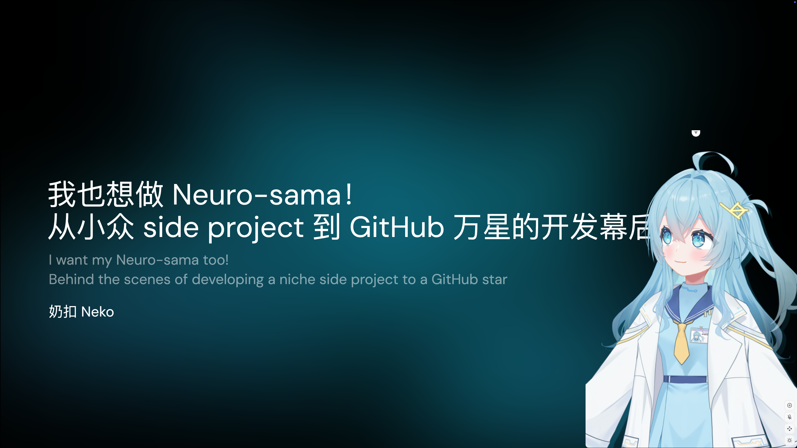
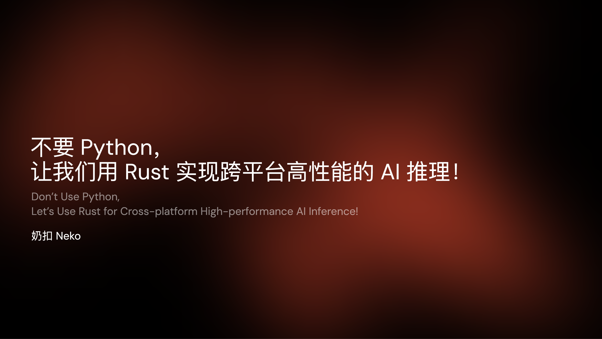

# Talks

> Public talks I presented historically
>
> 历史上我参与过的全部公开分享

## Upcoming...

|  |  |
| --- | --- |

## Presented...

|  |  |
| --- | --- |
|  | 2025.10 @ Shanghai x 复旦大学 |
| 我也想做 Neuro-sama！从小众 side project 到 GitHub 万星的开发幕后 (🇨🇳) | [Slides](https://talks.ayaka.io/nekoayaka/2025-10-24-fudan-university-airi-dev-talk) |
|  | 2025.08 @ Shanghai x Kong |
| 不要 Python，让我们用 Rust 实现跨平台高性能的 AI 推理！ (🇨🇳) | [Slides](https://talks.ayaka.io/nekoayaka/2025-08-09-rust-with-ai-for-better-portability) |
|  | 2025.06.11 @ Hong Kong x KubeCon |
| Taming Dependency Chaos for LLM in K8S (🇬🇧) | [Slides](https://baizeai.github.io/talks/2025-06-11-kubecon-hk/) |
|  | 2025.05.10 @ Hangzhou |
| [AIRI](https://github.com/moeru-ai/airi): 我们是如何从零实现外网爆火的 AI 主播的 (🇨🇳) | [Slides](https://talks.ayaka.io/nekoayaka/2025-05-10-airi-how-we-recreated-it/) |
|  | 2025.04.12 @ Shanghai x 模速空间 |
| MCP 是什么？机遇以及可能的未来 (🇨🇳) | [Slides](https://talks.ayaka.io/nekoayaka/2025-04-13-what-is-mcp-and-how-it-helps/) |
|  | 2025.03.13 @ Shanghai x DaoCloud |
| 深入浅出 LLM 4：DeepSeek 为什么这么火？ (🇨🇳) | [Slides](https://talks.ayaka.io/nekoayaka/2025-03-13-deep-dive-llm-deepseek-and-how/) |
|  | 2024.11.14 @ Shanghai x DaoCloud |
| 深入浅出 LLM 3：训练后范式的开启 (🇨🇳) | [Slides](https://talks.ayaka.io/nekoayaka/2024-11-14-deep-dive-llm-era-of-post-training/) |
|  | 2024.09.01 @ Shanghai x Demo Inn |
| Seamless agent toolkit, and unified LLM gateway (🇬🇧) | [Slides](https://talks.ayaka.io/nekoayaka/2024-09-01-demo-inn-sh/) |
|  | 2024.08.23 @ Hong Kong x KubeCon |
| No More Runtime Setup! Let's Bundle, Distribute, Deploy, Scale LLMs Seamlessly with Ollama Operator (🇬🇧) | [Slides](https://talks.ayaka.io/nekoayaka/2024-08-23-kubecon-hk/) |
|  | 2024.08.21 @ Hong Kong x KubeCon |
| Sit Back and Relax with Fault Awareness and Robust Instant Recovery for Large Scale AI Workloads (🇬🇧) | [Slides](https://baizeai.github.io/talks/2024-08-21-kubecon-hk/) |
|  | 2024.04.18 @ Shanghai x DaoCloud |
| 深入浅出 LLM 2：理解自注意力机制 (🇨🇳) | [Slides](https://talks.ayaka.io/nekoayaka/2024-04-18-deep-dive-llm-understand-attention-heads-share/) |
|  | 2023.12.21 @ Shanghai x DaoCloud |
| 深入浅出 LLM：大语言模型 (🇨🇳) | [Slides](https://talks.ayaka.io/nekoayaka/2023-12-21-deep-dive-llm-unleash-the-potentials-of-llm-share/) |
